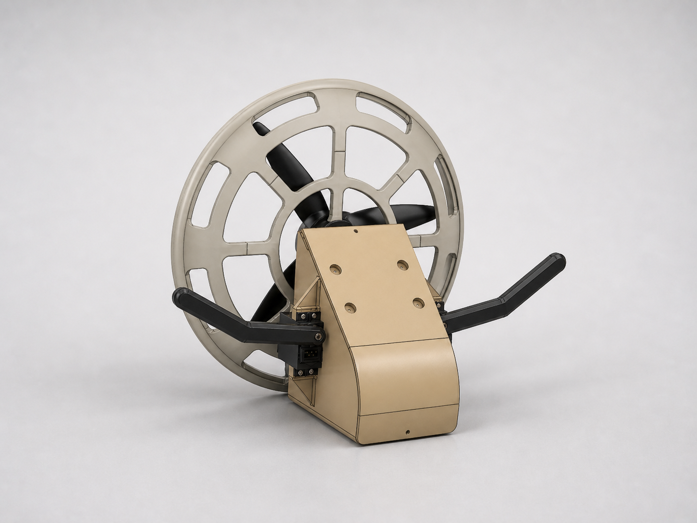
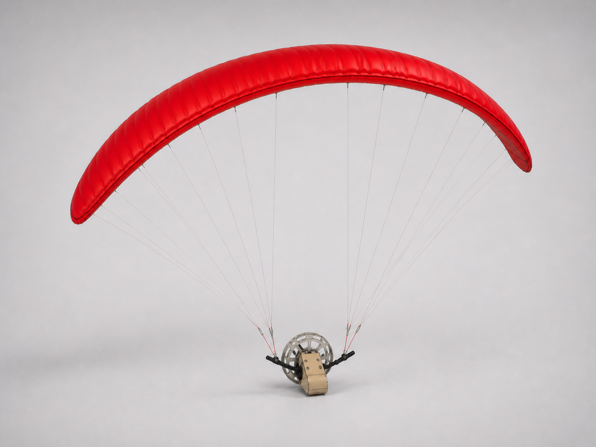

# PARAGLIDER-RTG

**Unmanned Paraglider for Logistics and Long Endurance**

Autonomous RC paramotor SITL stack: **Gazebo Harmonic + ArduPilot SITL + custom firmware mixer + Python bridge**.

<p align="center">
  
</p>

End-to-end software-in-the-loop simulator for a small RC paramotor (0.38 kg, single pusher prop, two brake-line "arms"). Vehicle steers via asymmetric brake-line pull instead of traditional control surfaces.

<p align="center">
  
</p>

---

## Control Logic

The paraglider is controlled via **3 RC channels** mapped through custom firmware in ArduPlane and a Python bridge that applies bounded virtual forces to the vehicle in Gazebo.

### RC Stick → Vehicle Response

| Stick | RC | Value | Effect on Vehicle | Mechanism |
|-------|----|----|-------------------|-----------|
| **Throttle UP** | RC3 | 1000 → 2000 | Forward thrust + slight upward force | Bridge applies 0 → 5 N forward + 0 → 0.8 N up |
| **Throttle DOWN** | RC3 | 1000 | Motor off, no thrust | Vehicle decelerates, glides |
| **Pitch FORWARD** (push stick away) | RC2 | 1500 → 1100 | Both brake arms PULL DOWN → flare/dive | Firmware: `arm_common = elev_norm > 0`, both arms scaled |
| **Pitch BACK** (pull stick toward) | RC2 | 1500 → 1900 | Arms RELEASED + climb assist | Bridge: +Z force via `SERVO7 k_scripting1` channel |
| **Roll RIGHT** | RC1 | 1500 → 1900 | Right arm pulls down + bank right | Firmware differential mixer + bridge lateral force + roll torque |
| **Roll LEFT** | RC1 | 1500 → 1100 | Left arm pulls down + bank left | Mirror of right |

### Force/Torque Mapping (Bridge body frame)

```
Body axes: -Y = forward (nose), +Z = up, +X = right wing

FORCES applied to fuselage link via EntityWrench:
  F_y = -throttle × THRUST_FWD       # forward thrust (-Y body)
  F_z =  VEHICLE_WEIGHT              # constant gravity-cancel (canopy "always inflated")
       + throttle × THRUST_UP        # slight climb component
       + pitch_up × PITCH_UP_FORCE   # extra upward when stick BACK
       - pitch_down × PITCH_DOWN_FORCE  # spill lift when stick FORWARD
  F_x = ail_norm × 1.0               # lateral nudge (banking)

TORQUES applied for attitude control:
  τ_x = -K_RP × roll  - D_RP × ω_x   # auto-level roll
  τ_y = -K_RP × pitch - D_RP × ω_y   # auto-level pitch
  τ_z = -ail × 0.05 - D_yaw × ω_z    # roll input → yaw turn (banking)

Constants:
  THRUST_FWD       = 5.0 N    VEHICLE_WEIGHT   = 3.53 N (= 0.36 kg × g)
  THRUST_UP        = 0.8 N    PITCH_UP_FORCE   = 2.0 N
  PITCH_DOWN_FORCE = 1.0 N    K_RP             = 0.8 N·m/rad
  D_RP             = 0.4 N·m·s/rad
```

### Signal Flow

```
QGroundControl                                          Gazebo simulator
    │                                                          │
    │ UDP 14550 (MAVLink RC overrides)                         │
    ▼                                                          ▼
┌─────────────┐    TCP 5760     ┌────────────┐    UDP 9002   ┌──────────────┐
│ forwarder   │ ─────────────▶  │ ArduPlane  │ ──PWM[16]──▶  │ bridge.py    │
│ (Python)    │                  │ SITL       │               │              │
└─────────────┘                  │            │ ◀──sensor──── │ - reads PWM  │
                                 │ Custom     │   JSON state  │ - applies    │
                                 │ paraglider │               │   wrench     │
                                 │ mixer in   │               │ - drives     │
                                 │ servos.cpp │               │   gz topics  │
                                 └────────────┘               └──────────────┘
                                                                      │
                                                              gz topics:
                                                              /paraglider_uav/command/motor_speed
                                                              /arm/left, /arm/right
                                                              /world/.../wrench (EntityWrench)
```

### Why Custom Mixer

Stock ArduPlane fixed-wing mixer maps RC1/RC2 to aileron/elevator servos — wrong for paraglider. Real paragliders have **no elevator, no rudder, no ailerons**. Steering comes from differential brake-line pull (asymmetric trailing-edge deflection). Pitch comes from symmetric brake or weight shift.

The custom firmware mixer in `~/ardupilot/ArduPlane/servos.cpp`:
1. **Reads raw RC** directly (`rc().channel(N)->norm_input()`), bypassing ArduPlane's attitude controller
2. **Maps roll → differential, pitch-down → symmetric** brake pull
3. **Outputs to `k_flaperon_left/right`** (servo functions 24/25) which drive the brake arms
4. **Throttle override** — forces RC3 → motor in ANY mode (bypasses LOITER's TECS auto-throttle so pilot retains motor authority)

### Safety Features

- **RC failsafe gate** — if RC signal lost, motor + arms zero, canopy released
- **Pitch damper** — auto-brake both arms if nose pitches up >20° (prevents rocket)
- **Auto-release on dive** — if pitch <-10°, arms force-released so canopy can re-pressurize
- **PWM watchdog in bridge** — if AP silent for >0.5s, all forces zero (vehicle freezes, no runaway)
- **Auto-level torques** — bridge applies world-frame restoring torques `τ = -K·attitude - D·ω`, preventing tumble without active firmware PID

---

## Quick Start

```bash
# 1. Kill stale processes + free ports
ps aux | grep -E "gz sim|paraglider_bridge|arduplane|sim_vehicle|mav_forw" | grep -v grep | awk '{print $2}' | xargs -I{} kill -9 {}
for port in 14550 14551 14552 5760 9002; do
  for p in $(lsof -iTCP:$port -t) $(lsof -iUDP:$port -t); do kill -9 $p 2>/dev/null; done
done

# 2. Launch (in order, observing sleeps)
export GZ_SIM_RESOURCE_PATH=$HOME/.gz/models:$GZ_SIM_RESOURCE_PATH
gz sim -s -r ~/paraglider_sim/sdf/world.sdf -v 2 > /tmp/gz.log 2>&1 &        # physics
sleep 5
gz sim -g > /tmp/gz_gui.log 2>&1 &                                            # 3D GUI
sleep 4
python3 -u ~/paraglider_sim/firmware/bridge/paraglider_bridge.py > /tmp/bridge.log 2>&1 &
sleep 2
cd /tmp && ~/ardupilot/Tools/autotest/sim_vehicle.py -v ArduPlane -f JSON \
  --add-param-file=$HOME/paraglider_sim/firmware/params/paraglider.parm \
  --no-mavproxy --no-rebuild --wipe-eeprom -L CMAC > /tmp/ap.log 2>&1 &
disown
sleep 14
python3 -u ~/paraglider_sim/firmware/scripts/mav_forwarder.py > /tmp/fwd.log 2>&1 &
sleep 4

# 3. Apply runtime params (see docs/PARAMS.md)
# 4. Open QGroundControl → connects auto to UDP 14550
# 5. Arm + advance throttle
```

Full launch in [docs/LAUNCH.md](docs/LAUNCH.md).

---

## Documentation

| File | Topic |
|------|-------|
| [docs/ARCHITECTURE.md](docs/ARCHITECTURE.md) | Stack diagram, data flow, port assignments |
| [docs/PHYSICS.md](docs/PHYSICS.md) | `model.sdf` params, mass/inertia, joints |
| [docs/FIRMWARE.md](docs/FIRMWARE.md) | Custom ArduPlane mixer in `servos.cpp` |
| [docs/BRIDGE.md](docs/BRIDGE.md) | Python bridge force/torque mapping |
| [docs/LAUNCH.md](docs/LAUNCH.md) | Launch sequence, common commands |
| [docs/PARAMS.md](docs/PARAMS.md) | ArduPilot parameter reference |
| [docs/TROUBLESHOOTING.md](docs/TROUBLESHOOTING.md) | 15+ known issues + fixes |
| [docs/CHANGELOG.md](docs/CHANGELOG.md) | Development timeline + lessons |

---

## Dependencies

- macOS (tested Darwin 25.4.0) or Linux
- Gazebo Harmonic — `brew install gz-harmonic`
- ArduPilot SITL — `~/ardupilot/` cloned + built (`./waf plane`)
- Python 3.14+ — `pip install pymavlink gz-transport13 gz-msgs10`
- QGroundControl

---

## Status

- ✅ Vehicle moves forward on throttle (bounded ~5 m/s ground roll)
- ✅ Brake arms respond to RC1/RC2 sticks (visual + flight control)
- ✅ Auto-level prevents tumbling
- ✅ Bounded thrust (no rocket-to-orbit)
- ✅ PWM watchdog (vehicle freezes if AP dies)
- ⚠️ Sustained level cruise needs TECS-style controller (open-loop physics oscillates)
- ⚠️ Real canopy pendulum dynamics not modeled (canopy is rigidly fixed at fuselage level; aero from bridge virtual physics)

---

## License

Project files: MIT.
ArduPilot fork: GPLv3 (ArduPilot license).
